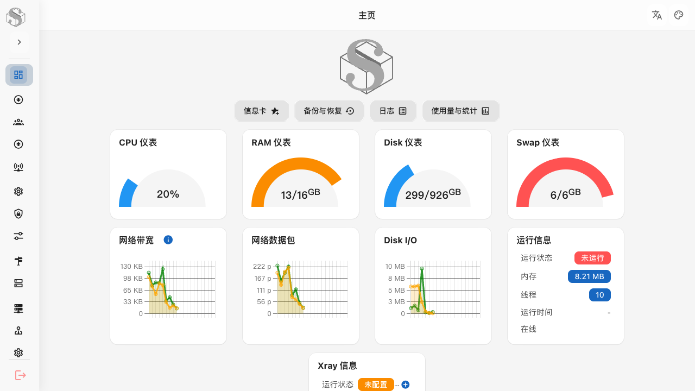
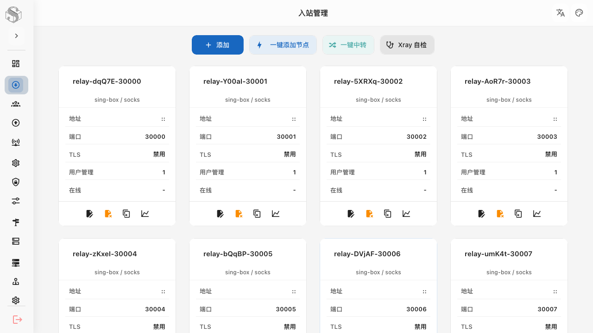
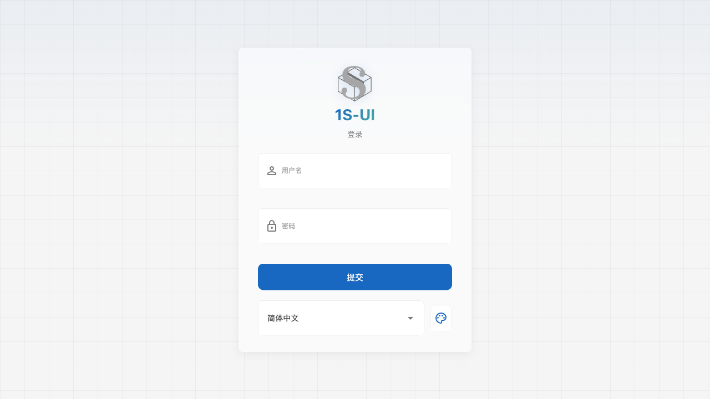

# 1S-UI

[](https://github.com/Hhz0823/1s-ui/releases/latest)
[](LICENSE)
[](go.mod)
[](frontend/package.json)
[](https://github.com/SagerNet/sing-box)
[](https://github.com/XTLS/Xray-core)

**最新版本 Latest:** [v1.5.1](https://github.com/Hhz0823/1s-ui/releases/tag/v1.5.1)

基于 [S-UI](https://github.com/alireza0/s-ui) 二次开发的现代代理管理面板。默认内核 **sing-box**，入站可切换 **Xray-core**；面向 Linux 服务器（Ubuntu / Debian），提供 Web 管理、订阅、TLS 自动化、一键中转，以及类似哪吒 / Komari 的多服务器 Agent 监控与远程控制。

A modern proxy panel forked from S-UI: sing-box first, optional Xray-core per inbound, Linux-focused, with multi-server agents (monitor + remote control + terminal).

> 仅用于学习、研究与技术交流。请遵守当地法律法规。  
> For learning and research only. Comply with local laws.

**语言 Languages:** [简体中文](#简体中文) · [English](#english) · [日本語](#日本語) · [한국어](#한국어)

---

## Screenshots

演示数据截图，不含真实密钥。 Demo data only.

| 首页 Dashboard | 入站 Inbounds | 登录 Login |
| --- | --- | --- |
|  |  |  |

---

## 简体中文

### 项目说明

| 项 | 内容 |
| --- | --- |
| 上游 | [alireza0/s-ui](https://github.com/alireza0/s-ui) |
| 默认内核 | [sing-box](https://github.com/SagerNet/sing-box) |
| 可选内核 | [Xray-core](https://github.com/XTLS/Xray-core)（按入站选择） |
| 主维护平台 | Linux：Ubuntu、Debian、Docker |
| 暂停 / 实验 | Windows 暂停维护；OpenWrt Lite 实验版 |

### 功能特性

#### 面板与代理

- 入站 / 出站 / 端点 / 服务 / DNS / 路由 / 用户 / 管理员
- **双内核**：入站可选 `sing-box` 或 `xray`
- 一键添加节点（端口、标签、用户、TLS、协议默认值）
- TLS / ACME / ECH / Reality / Pinned SHA256 集中管理
- 订阅服务与分享链接（Clash / JSON / 标准 URI，兼容 v2rayN）
- Shadowsocks 默认 `2022-blake3-aes-256-gcm`
- 首页仪表盘、日志、备份恢复、流量统计

#### Xray-core（v1.5）

| 类型 | 支持 |
| --- | --- |
| 入站协议 | VLESS、VMess、Trojan、Shadowsocks、SOCKS、HTTP、Mixed、Hysteria2、Dokodemo-door、**WireGuard** |
| 传输 | XHTTP、RAW、mKCP、gRPC、WebSocket、HTTPUpgrade |
| 已移除（上游） | HTTP/2、旧 QUIC → 请用 XHTTP stream-one / H3 |
| 自检 | 二进制版本、配置校验、运行状态、协议/传输能力列表 |

#### 一键中转

- 模式：本机公网 IPv6 池 / 上游 SOCKS5
- 协议：SOCKS、HTTP、Mixed、SS、VLESS、VMess、Trojan、Hysteria2、TUIC、Naive、AnyTLS
- 自动创建入站、用户、出站、路由；支持 BitBrowser Excel 导出
- IPv6 用 `ip -6 addr add` 添加，等待 DAD，失败回滚；**不改默认路由**
- 参考 [auto-add-ipv6](https://github.com/help660vip/auto-add-ipv6) 流程，Go 内置实现，不执行远程脚本

#### 服务器 Agent（v1.5，类哪吒 / Komari）

Agent **主动出站**连面板，节点上不开放控制端口。

| 能力 | 说明 |
| --- | --- |
| 连接 | HTTP 心跳 + **WebSocket 长连接**（优先 WS） |
| 监控 | CPU、内存、磁盘、负载、进程数、实时带宽、地址、sing-box/Xray 状态 |
| 远程控制 | 刷新指标、Ping、改上报间隔、重启 Xray / sing-box / Agent、执行 Shell（需 WS） |
| 交互终端 | 浏览器 PTY 终端，经面板桥接到远端 Shell |
| 批量控制 | 勾选多节点，统一下发指令并汇总结果 |
| 鉴权 | 面板登录 Session；Agent Token 仅创建/轮换时显示一次 |

仅 HTTP 在线：可监控，不可控制。WebSocket 在线：可控制 / 终端 / 批量。

### 快速安装

安装脚本会**先分析 VPS**，再决定是否安装服务端、Xray、以及反向代理（Caddy/Nginx）。

```bash
# 最新版（交互预检）
bash <(curl -Ls https://raw.githubusercontent.com/Hhz0823/1s-ui/main/install.sh)

# 指定版本
bash <(curl -Ls https://raw.githubusercontent.com/Hhz0823/1s-ui/main/install.sh) v1.5.1

# 非交互 + 不装 Xray + 启用反代（域名 HTTPS）
bash <(curl -Ls https://raw.githubusercontent.com/Hhz0823/1s-ui/main/install.sh) -y --no-xray --with-proxy --domain panel.example.com --email a@b.com
```

| 档位 | 服务端 | Xray | 反代 |
| --- | --- | --- | --- |
| tiny (&lt;450MB) | 需确认 | 默认否 | 否 |
| low (&lt;1GB) | 是 | 默认否 | 可选 Nginx |
| standard / high | 是 | 建议是 | 推荐 Caddy（可自动 HTTPS） |

覆盖推荐：`--with-xray` / `--no-xray` / `--with-proxy` / `--no-proxy` / `--domain` / `--force`

反代启用后，面板默认仅监听 `127.0.0.1`，通过 80/443 访问 `/app/`。

| 配置 | 默认 |
| --- | --- |
| 面板端口 | `2095` |
| 面板路径 | `/app/` |
| 订阅端口 | `2096` |
| 订阅路径 | `/sub/` |
| 数据目录 | `/usr/local/s-ui/db` |
| 默认账号 | `admin` / `admin`（安装后请立刻修改） |

```bash
s-ui            # 管理菜单
s-ui status
s-ui log
s-ui update
```

### 安装 Agent

1. 打开面板 **服务器监控**
2. 添加节点，复制一次性安装命令
3. 在目标机器执行（会写入 `/etc/default/1s-ui-agent` 并启用 systemd）

手动示例：

```bash
sui agent --panel 'https://你的域名:2095/app/' --token '<一次性Token>'
```

### Docker

```bash
docker run -itd \
  --network host \
  -v "$PWD/db:/app/db" \
  -v "$PWD/cert:/app/cert" \
  --name s-ui \
  --restart unless-stopped \
  ghcr.io/Hhz0823/1s-ui
```

`docker-compose` 示例：

```yaml
services:
  s-ui:
    image: ghcr.io/Hhz0823/1s-ui
    container_name: s-ui
    network_mode: host
    volumes:
      - "./db:/app/db"
      - "./cert:/app/cert"
    restart: unless-stopped
    entrypoint: "./entrypoint.sh"
```

### OpenWrt Lite（实验）

仅含 sing-box，无 Xray。从 [Releases](https://github.com/Hhz0823/1s-ui/releases/latest) 下载 `s-ui-lite_*.ipk`：

```bash
opkg install ./s-ui-lite_1.5.1-1_x86_64.ipk
/etc/init.d/s-ui-lite enable
/etc/init.d/s-ui-lite start
```

详见 [docs/openwrt-lite.md](docs/openwrt-lite.md)。

### 页面一览

| 页面 | 说明 |
| --- | --- |
| 首页 | 仪表盘、状态、备份、日志、用量 |
| 入站管理 | 入站 CRUD、快速添加、Xray 自检 |
| 一键中转 | IPv6 / 上游 SOCKS5 批量节点 |
| 用户管理 | 流量、到期、分组、在线、二维码 |
| 出站 / 端点 / 服务 | 协议与拨号、WG/Tailscale/Warp、CCM 等 |
| TLS / DNS / 路由 / 基础 | 证书与 Reality、DNS、规则、全局配置 |
| **服务器监控** | Agent 列表、详情、控制、终端、批量 |
| 管理员 / 设置 | 账号 Token、面板与系统网络参数 |

### v1.5.1 变更

- 扩展 Xray 入站（含 WireGuard）与自检展示
- Agent：WebSocket 控制面、交互终端、多节点批量指令
- 更丰富的节点指标（带宽、负载、进程数等）
- 文档与默认安装版本对齐 `v1.5.1`

---

## English

### Overview

| | |
| --- | --- |
| Upstream | [alireza0/s-ui](https://github.com/alireza0/s-ui) |
| Default core | [sing-box](https://github.com/SagerNet/sing-box) |
| Optional core | [Xray-core](https://github.com/XTLS/Xray-core) (per inbound) |
| Primary OS | Linux (Ubuntu, Debian), Docker |
| Other | Windows maintenance paused; OpenWrt Lite experimental |

### Features

**Panel:** inbounds/outbounds/endpoints/services/DNS/routes/users/admins; dual-core selection; quick add; TLS/ACME/ECH/Reality; subscriptions & v2rayN-friendly links; dashboard, logs, backup, traffic stats.

**Xray (v1.5):** VLESS, VMess, Trojan, Shadowsocks, SOCKS, HTTP, Mixed, Hysteria2, Dokodemo-door, WireGuard; transports XHTTP/RAW/mKCP/gRPC/WS/HTTPUpgrade; self-check UI.

**Relay:** IPv6 pool or upstream SOCKS5; multi-protocol batch; BitBrowser Excel export; safe IPv6 add with DAD + rollback (no default-route changes).

**Agents (v1.5):** outbound HTTP + WebSocket; metrics; remote control (restart cores, exec, interval); interactive PTY terminal; multi-node batch commands. Control requires WebSocket online + panel login.

### Install

```bash
bash <(curl -Ls https://raw.githubusercontent.com/Hhz0823/1s-ui/main/install.sh)
# or
bash <(curl -Ls https://raw.githubusercontent.com/Hhz0823/1s-ui/main/install.sh) v1.5.1
```

Defaults: panel `2095` `/app/`, sub `2096` `/sub/`, DB `/usr/local/s-ui/db`, login `admin`/`admin` (change immediately).

```bash
s-ui / s-ui status / s-ui log / s-ui update
```

**Agent:** enroll under **Server Agents**, run the one-time install command on each host, or:

```bash
sui agent --panel 'https://host:2095/app/' --token '<token>'
```

### Docker

```bash
docker run -itd --network host \
  -v "$PWD/db:/app/db" -v "$PWD/cert:/app/cert" \
  --name s-ui --restart unless-stopped \
  ghcr.io/Hhz0823/1s-ui
```

### OpenWrt Lite

```bash
opkg install ./s-ui-lite_1.5.1-1_x86_64.ipk
/etc/init.d/s-ui-lite enable && /etc/init.d/s-ui-lite start
```

See [docs/openwrt-lite.md](docs/openwrt-lite.md).

### v1.5.1 highlights

- Broader Xray inbound set + self-check
- Agent control plane (WS), PTY terminal, batch commands
- Richer host metrics

---

## 日本語

[S-UI](https://github.com/alireza0/s-ui) ベースのプロキシ管理パネル。標準は sing-box、入站ごとに Xray-core を選択可能。主に Ubuntu / Debian 向け。v1.5 では Agent による監視・遠隔操作・対話型ターミナルに対応。

```bash
bash <(curl -Ls https://raw.githubusercontent.com/Hhz0823/1s-ui/main/install.sh) v1.5.1
```

Docker: `ghcr.io/Hhz0823/1s-ui`（`network_mode: host` 推奨）。OpenWrt Lite は実験版（sing-box のみ）。詳細は上の English / 中文 を参照。

---

## 한국어

[S-UI](https://github.com/alireza0/s-ui) 기반 프록시 관리 패널. 기본 코어 sing-box, 인바운드별 Xray-core 선택. 주로 Ubuntu/Debian 지원. v1.5: Agent 모니터링·원격 제어·대화형 터미널·다중 노드 일괄 명령.

```bash
bash <(curl -Ls https://raw.githubusercontent.com/Hhz0823/1s-ui/main/install.sh) v1.5.1
```

Docker: `ghcr.io/Hhz0823/1s-ui`. OpenWrt Lite는 실험 버전. 자세한 내용은 위 중문/영문 섹션 참고.

---

## 源码构建 Build

```bash
cd frontend && npm install && npm run build && cd ..
rm -rf web/html/* && cp -R frontend/dist/* web/html/
go build -o sui main.go
```

```bash
go test ./...
cd frontend && npm run build
```

## 环境变量 Environment

| 变量 | 默认 | 说明 |
| --- | --- | --- |
| `SUI_LOG_LEVEL` | `info` | 日志级别 |
| `SUI_DEBUG` | `false` | 调试模式 |
| `SUI_DB_FOLDER` | 程序目录下 `db` | 数据库目录 |
| `SUI_BIN_FOLDER` | 程序目录下 `bin` | 运行时二进制 |
| `SUI_XRAY_PATH` | `$SUI_BIN_FOLDER/xray` | Xray 路径 |
| `SUI_XRAY_CONFIG` | `$SUI_BIN_FOLDER/xray.json` | Xray 配置路径 |

## 目录结构 Structure

```text
.
├── api/          # HTTP API、Agent 控制桥接、终端 WebSocket
├── agent/        # 服务器 Agent（指标、指令、PTY）
├── app/          # 应用启动
├── cmd/          # CLI、agent runner、迁移
├── config/       # 版本与环境配置
├── core/         # sing-box / Xray 运行时
├── database/     # SQLite 与模型
├── docs/         # 文档与截图
├── frontend/     # Vue 3 + Vuetify
├── service/      # 业务与 agent hub
├── sub/          # 订阅
├── util/         # 链接与配置工具
├── web/          # Web 服务
└── windows/      # Windows 脚本（暂停维护）
```

## 安全建议 Security

1. 安装后立即修改默认管理员密码  
2. 使用非默认面板路径与端口  
3. 保护数据库、证书、私钥、API Token  
4. Agent Token 仅创建/轮换时显示，请安全保存安装命令  
5. 公网面板务必 HTTPS  
6. **远程 Shell / 终端权限 = Agent 进程用户（常为 root）**，严格限制面板登录权限  
7. 控制与终端需要：面板已登录 + Agent WebSocket 在线  

## 鸣谢 Credits

- [SagerNet/sing-box](https://github.com/SagerNet/sing-box)
- [XTLS/Xray-core](https://github.com/XTLS/Xray-core)
- [alireza0/s-ui](https://github.com/alireza0/s-ui)
- 测试与反馈的用户们

## 许可证 License

[GPL-3.0](LICENSE)
